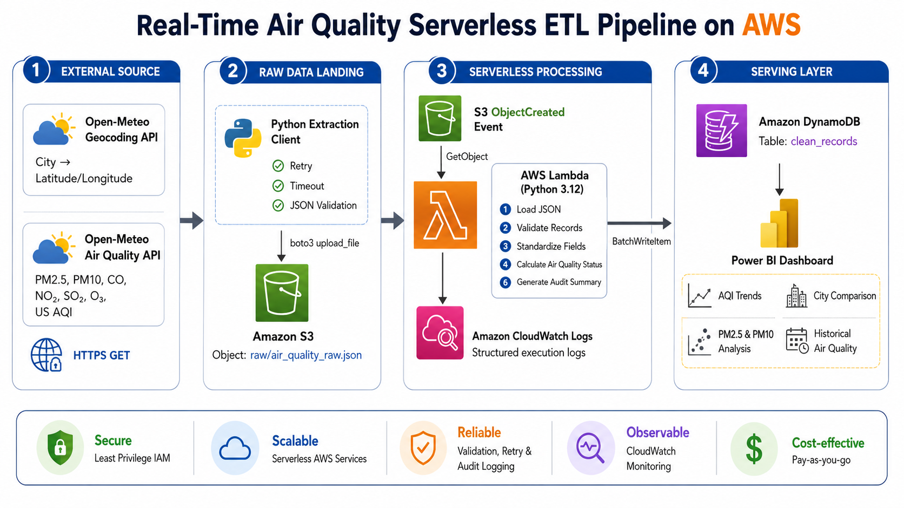

# Air Quality Serverless ETL Pipeline on AWS


## Overview

This project is a serverless ETL pipeline that extracts current air quality data for major Indian cities from the Open-Meteo Air Quality API, stores the raw JSON in Amazon S3, transforms and validates the records with AWS Lambda, and loads clean records into Amazon DynamoDB. Lambda execution details and audit counts are written to CloudWatch Logs.

## Architecture



```text
Open-Meteo Air Quality API
        |
        v
Python extraction script
        |
        v
data/raw/air_quality_raw_YYYYMMDD_HHMMSS.json
        |
        v
Amazon S3 raw/
        |
        v
AWS Lambda
        |
        +-- Validate records
        +-- Transform fields
        +-- Calculate air quality status
        +-- Write audit summary
        |
        v
Amazon DynamoDB
        |
        v
CloudWatch Logs
```

## AWS Services

- Amazon S3 for raw JSON storage
- AWS Lambda for serverless transformation and loading
- Amazon DynamoDB for clean air quality records
- Amazon CloudWatch for execution logs and audit summaries
- AWS CodeBuild and CodePipeline for Lambda packaging and deployment
- GitHub Actions for CI checks

## Data Collected

The extraction script collects these Open-Meteo air quality fields:

- PM2.5
- PM10
- Carbon monoxide
- Nitrogen dioxide
- Sulphur dioxide
- Ozone
- US AQI

Configured cities:

- Delhi
- Mumbai
- Pune
- Bengaluru
- Hyderabad
- Chennai
- Kolkata
- Jaipur

## Project Structure

```text
air-quality-s3-lambda-dynamodb-etl/
|
+-- extraction/
|   +-- config.py
|   +-- extract.py
|   +-- main.py
|   +-- upload_to_s3.py
|
+-- lambda/
|   +-- lambda_function.py
|   +-- transformations.py
|   +-- utils.py
|   +-- requirements.txt
|
+-- tests/
+-- data/
|   +-- raw/
|   +-- sample_output/
|
+-- screenshots/
+-- .github/
|   +-- workflows/
|       +-- ci.yml
|
+-- buildspec.yml
+-- architecture.png
+-- README.md
+-- requirements.txt
```

## DynamoDB Item Shape

| Attribute | Type | Description |
| --- | --- | --- |
| record_id | String | Partition key, built from city and source timestamp |
| city | String | Uppercase city name |
| timestamp | String | Open-Meteo reading timestamp |
| latitude | Number | City latitude |
| longitude | Number | City longitude |
| pm25 | Number | PM2.5 value |
| pm10 | Number | PM10 value |
| carbon_monoxide | Number | CO value |
| nitrogen_dioxide | Number | NO2 value |
| sulphur_dioxide | Number | SO2 value |
| ozone | Number | O3 value |
| air_quality_index | Number | US AQI value |
| air_quality_status | String | GOOD, MODERATE, UNHEALTHY_FOR_SENSITIVE, UNHEALTHY, VERY_UNHEALTHY, or HAZARDOUS |
| processed_at_utc | String | Lambda processing timestamp |

## Setup

Create and activate a virtual environment, then install dependencies:

```bash
python -m venv .venv
source .venv/bin/activate
pip install -r requirements.txt
```

For Windows PowerShell:

```powershell
python -m venv .venv
.\.venv\Scripts\Activate.ps1
pip install -r requirements.txt
```

Copy the sample environment file and update the values for your AWS account:

```bash
cp .env.example .env
```

Required Lambda environment variables:

```text
TABLE_NAME=air_quality_readings
BUCKET_NAME=cities-air-quality-bucket
OBJECT_KEY=raw/air_quality_raw.json
AWS_REGION=us-east-1
```

`OBJECT_KEY` is used only for manual Lambda runs. For S3-triggered Lambda runs, the function reads the uploaded bucket and key from the S3 event.

## Run Locally

Extract all configured city records into one raw JSON file:

```bash
python extraction/main.py
```

Upload the newest local raw JSON file to S3 under `raw/`:

```bash
python extraction/upload_to_s3.py
```

Run tests:

```bash
pytest
```

Run a syntax check:

```bash
python -m compileall extraction lambda tests
```

## Lambda Deployment Package

Build the Lambda zip from the project root:

```bash
python scripts/build_lambda_package.py
```

For CodeBuild or a local build that must include dependencies from `lambda/requirements.txt`:

```bash
python scripts/build_lambda_package.py --install-deps
```

Upload `lambda_deployment_package.zip` to AWS Lambda and set the handler to:

```text
lambda_function.lambda_handler
```

Do not upload a zip that contains the whole project folder or an outer `lambda/` folder. The zip root must contain `lambda_function.py`, `transformations.py`, and `utils.py` directly.

## CI/CD

GitHub Actions runs on pushes to `main` and on pull requests. It installs dependencies, runs a Python syntax check, and runs the unit tests.

CodeBuild uses `buildspec.yml` to build `lambda_deployment_package.zip` from the Lambda source and Lambda dependencies. That artifact can be deployed through CodePipeline to AWS Lambda.

## Screenshots

Store project evidence in `screenshots/`, such as:

- S3 raw object
- Lambda execution
- DynamoDB table items
- CloudWatch audit logs
- GitHub Actions run
- CodeBuild or CodePipeline run

## Future Improvements

- EventBridge schedule for automated extraction
- Infrastructure as code with Terraform or AWS CDK
- Athena or Glue catalog over S3 raw data
- QuickSight or Power BI dashboard
- SNS alerting for unhealthy air quality

## Author

Mayank Shringi

MCA Student | Aspiring Data Engineer

GitHub: https://github.com/Mayank830205

LinkedIn: https://www.linkedin.com/in/mayank-shringi-28a536284

## License

This project is licensed under the MIT License.
